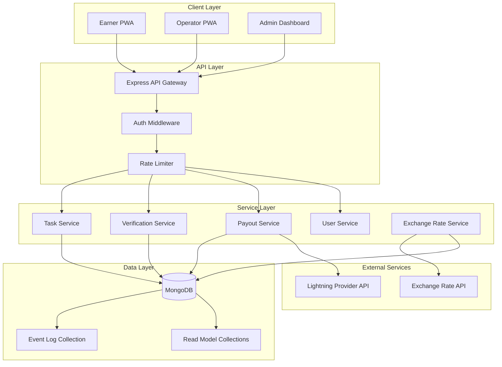
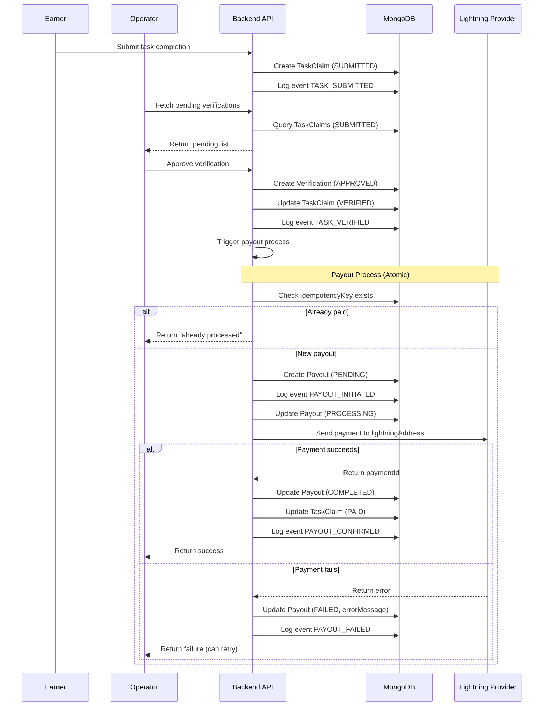

# Lightning Payday System - Phase 1 Architecture Plan

---

## Assumptions

- Custodial Lightning provider (e.g., Strike, Voltage, LNBits hosted) handles all wallet management
- Local currency is South African Rand (ZAR) - exchange rate fetched periodically, not per-transaction
- One Admin account controls the treasury Lightning wallet
- Youth Operators are trusted humans who verify task completion in-person
- Tasks are predefined by Admin (not user-generated)
- Offline-first PWA with background sync when connectivity returns
- No real-time features required (polling acceptable)

---

## 1. System Architecture



**Component Responsibilities:**| Component | Responsibility ||-----------|----------------|| Earner PWA | Claim tasks, view earnings history, submit Lightning address for payout || Operator PWA | View pending verifications, approve/reject task completions || Admin Dashboard | Manage tasks, view treasury, handle disputes, manage users || Express API Gateway | Single entry point, routing, request validation || Auth Middleware | JWT validation, role-based access control || Task Service | Task lifecycle (create, assign, complete) || Verification Service | Operator verification workflow || Payout Service | Lightning payment orchestration, idempotency || Exchange Rate Service | Periodic ZAR/BTC rate caching (every 15 min) |---

## 2. Core Data Models

### 2.1 User Model

| Field | Type | Description ||-------|------|-------------|| _id | ObjectId | Primary key || phone | String | Unique identifier (no email required) || pin | String | Hashed 4-6 digit PIN (low literacy friendly) || role | Enum | EARNER, OPERATOR, ADMIN || displayName | String | Human-readable name || lightningAddress | String | Optional, for earners (e.g., user@wallet.com) || status | Enum | ACTIVE, SUSPENDED, PENDING || createdAt | Date | Account creation timestamp || updatedAt | Date | Last modification timestamp |

### 2.2 Task Model

| Field | Type | Description ||-------|------|-------------|| _id | ObjectId | Primary key || title | String | Short task name || description | String | What needs to be done || rewardSats | Number | Payout amount in satoshis || rewardZAR | Number | Display amount at time of creation || maxClaims | Number | How many earners can claim this task || currentClaims | Number | Denormalized counter (rebuilt from events) || expiresAt | Date | Task availability window || createdBy | ObjectId | Admin who created it || status | Enum | DRAFT, ACTIVE, PAUSED, EXPIRED || createdAt | Date | Creation timestamp |

### 2.3 TaskClaim Model

| Field | Type | Description ||-------|------|-------------|| _id | ObjectId | Primary key || taskId | ObjectId | Reference to task || earnerId | ObjectId | Who claimed it || status | Enum | CLAIMED, SUBMITTED, VERIFIED, REJECTED, PAID || claimedAt | Date | When earner claimed || submittedAt | Date | When earner marked complete || evidence | String | Optional proof (photo URL, text) |

### 2.4 Verification Model

| Field | Type | Description ||-------|------|-------------|| _id | ObjectId | Primary key || taskClaimId | ObjectId | Reference to claim being verified || operatorId | ObjectId | Who performed verification || decision | Enum | APPROVED, REJECTED || reason | String | Optional rejection reason || verifiedAt | Date | Decision timestamp |

### 2.5 Payout Model (Critical - Source of Truth for Payments)

| Field | Type | Description ||-------|------|-------------|| _id | ObjectId | Primary key || idempotencyKey | String | Unique key (taskClaimId + attempt) to prevent double pay || taskClaimId | ObjectId | Which verified claim this pays || earnerId | ObjectId | Payment recipient || amountSats | Number | Satoshis sent || amountZAR | Number | ZAR equivalent at payment time || lightningAddress | String | Destination address used || status | Enum | PENDING, PROCESSING, COMPLETED, FAILED || externalPaymentId | String | Lightning provider's reference || errorMessage | String | Failure reason if applicable || initiatedAt | Date | When payment was requested || completedAt | Date | When payment was confirmed |

### 2.6 Event Log Model (Append-Only Audit Trail)

| Field | Type | Description ||-------|------|-------------|| _id | ObjectId | Primary key || eventType | String | e.g., TASK_CLAIMED, PAYOUT_INITIATED, PAYOUT_CONFIRMED || aggregateType | String | e.g., TaskClaim, Payout || aggregateId | ObjectId | Reference to the entity || payload | Object | Full event data snapshot || actorId | ObjectId | Who triggered this event || actorRole | String | Role at time of action || timestamp | Date | Event occurrence time || version | Number | Optimistic concurrency control |---

## 3. MongoDB Safety: Append-Only Event Sourcing Lite

**Core Principle:** Never trust derived balances. The Event Log is the source of truth.

### Write Pattern

1. All state changes are first written to the EventLog collection
2. Read models (TaskClaim.status, Payout.status) are updated after event is persisted
3. If read model update fails, it can be rebuilt from events

### Preventing Double Payments

```javascript
Before initiating any payout:
1. Check Payout collection for existing record with same idempotencyKey
2. If exists and status is COMPLETED → reject (already paid)
3. If exists and status is PROCESSING → return existing (in flight)
4. If exists and status is FAILED → allow retry with new idempotencyKey
5. If not exists → create Payout record with status PENDING before calling Lightning API
```


### Read Model Rebuilding

If data becomes inconsistent:

1. Query EventLog for all events of a given aggregateId
2. Replay events in timestamp order to reconstruct current state
3. Update read model collection

### Indexes Required

- EventLog: (aggregateType, aggregateId, timestamp)
- Payout: (idempotencyKey) unique
- TaskClaim: (taskId, earnerId) compound unique
- User: (phone) unique

---

## 4. Lightning Payment Flow




### Payment Timing Breakdown (Target: Under 60 seconds)

| Step | Expected Duration ||------|-------------------|| Operator taps "Approve" | 0s || API receives request | 1-3s (low bandwidth) || DB writes (Verification + Payout record) | 1-2s || Lightning API call | 5-15s || DB confirmation writes | 1-2s || Response to Operator | 1-3s || **Total** | **10-25s typical** |---

## 5. Failure Cases and Mitigations

### 5.1 Double Payment

| Scenario | Mitigation ||----------|------------|| Operator clicks "Approve" twice rapidly | Idempotency key check before creating Payout record || Network timeout, operator retries | Same idempotencyKey returns existing Payout status || System crash mid-payment | PROCESSING status prevents new attempts; background job checks LN provider for actual status |

### 5.2 Offline Operator

| Scenario | Mitigation ||----------|------------|| Operator loses connection during approval | PWA queues action locally, syncs when online || Operator phone dies mid-verification | TaskClaim remains in SUBMITTED state; another operator can verify || Extended offline period | Pending verifications visible to all operators in region |

### 5.3 Payment Failure

| Scenario | Mitigation ||----------|------------|| Lightning provider API down | Payout stays PENDING; background retry job (exponential backoff) || Invalid Lightning address | Payout marked FAILED with clear error; Earner notified to update address || Insufficient treasury balance | Admin alerted; payouts queued until funded || Payment stuck in PROCESSING | Background job polls LN provider after 60s; reconciles status |

### 5.4 Data Integrity

| Scenario | Mitigation ||----------|------------|| Read model out of sync | Rebuild from EventLog || Duplicate events | Events have unique (aggregateId, version) constraint || Partial write failure | Check EventLog first; if event exists but read model stale, rebuild |

### 5.5 Fraud Prevention

| Scenario | Mitigation ||----------|------------|| Operator self-approves | Operator cannot verify their own claims (enforced in API) || Earner claims same task twice | Compound unique index on (taskId, earnerId) || Fake task submissions | Require evidence (photo) for high-value tasks |---

## 6. PostgreSQL Migration Path

### Why This Architecture Enables Migration

1. **Event Log is portable** - Events are simple JSON documents; can be inserted into PostgreSQL JSONB column
2. **Read models are derived** - Can be rebuilt in PostgreSQL from migrated events
3. **No MongoDB-specific features** - No aggregation pipelines, no sharding, no MongoDB transactions

### Migration Steps (Future)

1. Create PostgreSQL schema mirroring MongoDB collections as tables
2. Write dual-write adapter (writes to both DBs during transition)
3. Migrate historical EventLog data via batch job
4. Rebuild all read model tables from events
5. Validate data parity
6. Switch read traffic to PostgreSQL
7. Switch write traffic to PostgreSQL
8. Decommission MongoDB

### Schema Compatibility Notes

| MongoDB | PostgreSQL Equivalent ||---------|----------------------|| ObjectId | UUID (or BIGSERIAL) || Embedded documents | JSONB or normalized tables || Flexible schema | Strict schema + JSONB for payload || Compound indexes | Same, native support |---

## 7. API Endpoints

### Authentication

| Method | Endpoint | Responsibility ||--------|----------|----------------|| POST | /auth/register | Create new user (phone + PIN) || POST | /auth/login | Authenticate, return JWT || POST | /auth/refresh | Refresh expired JWT || POST | /auth/logout | Invalidate token (optional) |

### Tasks (Earner)

| Method | Endpoint | Responsibility ||--------|----------|----------------|| GET | /tasks | List available tasks for claiming || POST | /tasks/:id/claim | Claim a task || POST | /tasks/:id/submit | Mark task as completed || GET | /my/claims | View own claimed/completed tasks |

### Verification (Operator)

| Method | Endpoint | Responsibility ||--------|----------|----------------|| GET | /verifications/pending | List claims awaiting verification || POST | /verifications/:claimId/approve | Approve and trigger payout || POST | /verifications/:claimId/reject | Reject with reason || GET | /verifications/history | View past verification decisions |

### Payouts (Earner)

| Method | Endpoint | Responsibility ||--------|----------|----------------|| GET | /my/payouts | View payout history || GET | /my/payouts/:id | View single payout status || PUT | /my/lightning-address | Update Lightning address |

### Admin

| Method | Endpoint | Responsibility ||--------|----------|----------------|| POST | /admin/tasks | Create new task || PUT | /admin/tasks/:id | Update task details || DELETE | /admin/tasks/:id | Deactivate task || GET | /admin/users | List all users || PUT | /admin/users/:id/status | Suspend/activate user || PUT | /admin/users/:id/role | Change user role || GET | /admin/treasury | View treasury balance and stats || GET | /admin/payouts | View all payouts (with filters) || POST | /admin/payouts/:id/retry | Manually retry failed payout |

### System

| Method | Endpoint | Responsibility ||--------|----------|----------------|| GET | /health | Liveness check || GET | /exchange-rate | Current ZAR/BTC rate |---

## 8. Key Tradeoffs

| Decision | Tradeoff ||----------|----------|| Custodial Lightning | Simplicity over sovereignty; acceptable for MVP || Phone + PIN auth | Accessibility over security; no email/password complexity || Append-only events | Storage growth vs. audit safety; worth it for financial system || No real-time updates | Polling vs. complexity; acceptable for low-bandwidth context || Single operator can approve | Speed vs. fraud risk; acceptable with audit trail || Satoshis stored, ZAR displayed | Exchange rate drift vs. user confusion; small amounts minimize impact |---

## Next Steps (Pending Approval)

Phase 2 will implement:

1. Project scaffolding (Express + React + MongoDB setup)
2. User authentication flow