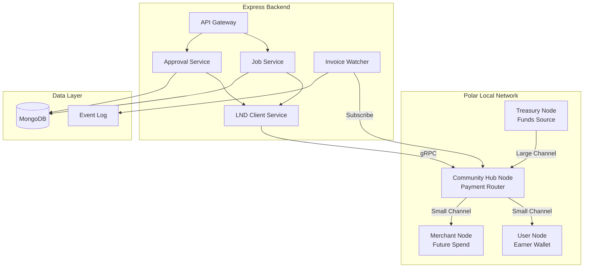
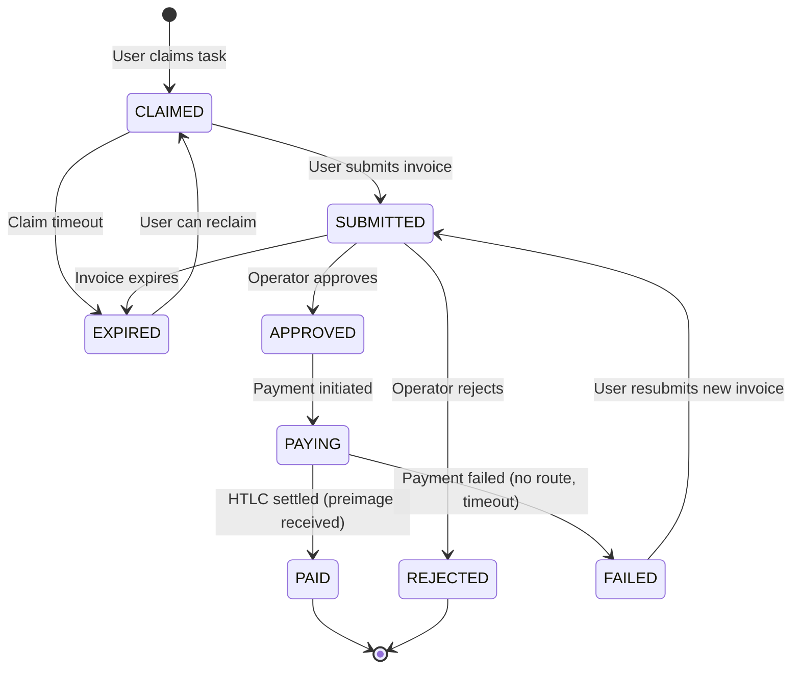

# Lightning Network Backend Architecture - Phase 1 Plan

---

## 1. System Architecture Overview




### Node Responsibilities

| Node | Role | Funds | Actions ||------|------|-------|---------|| Treasury | Cold storage, channel funding | High balance | Opens channels to Hub, refills Hub || Hub | Payment router, job payments | Working capital | Pays invoices to Users, routes to Merchants || User | Earner wallet | Earned sats | Generates invoices for completed jobs || Merchant | Spend destination | Variable | Generates invoices for purchases |

### Channel Topology Rationale

- **Treasury → Hub**: Large capacity (e.g., 10M sats) for liquidity buffer
- **Hub → User**: Small channels (e.g., 100K sats) sufficient for job payments
- **Hub → Merchant**: Small channels for future spend demo
- **No User ↔ User**: Eliminates complexity, Hub is single payment source

---

## 2. Backend Services and Modules

### 2.1 LND Client Service

**Purpose**: Abstracts all LND gRPC/REST communication**Responsibilities**:

- Connect to Hub node via macaroon + TLS cert
- Decode payment requests (invoices)
- Send payments (pay invoices)
- Subscribe to invoice settlement events
- Query channel balances and states
- Handle connection failures and retries

**LND APIs Used**:

- `lnrpc.Lightning/DecodePayReq` - Decode invoice to extract payment hash, amount, expiry
- `lnrpc.Lightning/SendPaymentSync` - Pay an invoice synchronously
- `routerrpc.Router/SendPaymentV2` - Pay with streaming status updates
- `lnrpc.Lightning/SubscribeInvoices` - Watch for incoming payments (if Hub receives)
- `lnrpc.Lightning/ListChannels` - Check channel liquidity
- `lnrpc.Lightning/GetInfo` - Node health check

### 2.2 Job Service

**Purpose**: Manages job lifecycle and invoice storage**Responsibilities**:

- Create job records with task metadata
- Store user-generated invoices against jobs
- Validate invoice parameters (amount, expiry)
- Transition job states based on events
- Emit events to EventLog for audit

**Key Operations**:

- `createJob(taskId, earnerId)` → Job in CLAIMED state
- `submitJob(jobId, invoice)` → Decode invoice, store payment_hash, transition to SUBMITTED
- `markJobPaid(jobId, preimage)` → Store preimage, transition to PAID

### 2.3 Approval Service

**Purpose**: Operator verification and payment authorization**Responsibilities**:

- Queue jobs for operator review
- Record approval/rejection decisions
- On approval: trigger payment via LND Client
- Handle payment failures and retries
- Prevent double-payment via idempotency

**Key Operations**:

- `getPendingApprovals()` → Jobs in SUBMITTED state
- `approveJob(jobId, operatorId)` → Pay invoice, transition to PAYING → PAID
- `rejectJob(jobId, operatorId, reason)` → Transition to REJECTED

### 2.4 Invoice Watcher Service

**Purpose**: Monitors Lightning payment settlement**Responsibilities**:

- Subscribe to Hub node payment events
- Match settled payments to job records via payment_hash
- Update job state on settlement confirmation
- Handle partial payments (reject, refund via new invoice)
- Detect expired invoices and trigger re-generation

**Event Stream**:

```javascript
Hub Node → gRPC Stream → Invoice Watcher → MongoDB Update → Event Log
```


### 2.5 Liquidity Monitor (Background)

**Purpose**: Ensures Hub has sufficient outbound liquidity**Responsibilities**:

- Periodically check Hub → User channel balances
- Alert if outbound capacity drops below threshold
- Trigger Treasury → Hub channel rebalance (manual or automated)

---

## 3. MongoDB Collections

### 3.1 Jobs Collection

```javascript
jobs {
  _id: ObjectId
  taskId: ObjectId              // Reference to task definition
  earnerId: ObjectId            // User who claimed the job
  
  // Lightning invoice data (source of truth is LND)
  invoice: {
    bolt11: String              // Full BOLT11 invoice string
    paymentHash: String         // Hex-encoded, indexed for lookup
    amountSats: Number          // Invoice amount
    expiry: Date                // When invoice expires
    description: String         // Invoice memo
    destination: String         // User node pubkey
  }
  
  // State machine
  status: Enum [CLAIMED, SUBMITTED, APPROVED, PAYING, PAID, REJECTED, EXPIRED, FAILED]
  
  // Payment settlement (only populated after payment)
  settlement: {
    preimage: String            // Hex-encoded preimage (proof of payment)
    settledAt: Date
    feeSats: Number             // Routing fee paid
  }
  
  // Metadata
  createdAt: Date
  updatedAt: Date
  submittedAt: Date
  approvedAt: Date
  approvedBy: ObjectId          // Operator who approved
  rejectedAt: Date
  rejectedBy: ObjectId
  rejectionReason: String
}

Indexes:
- { paymentHash: 1 } unique sparse
- { earnerId: 1, status: 1 }
- { status: 1, submittedAt: 1 }
- { taskId: 1 }
```


### 3.2 Events Collection (Append-Only Audit Log)

```javascript
events {
  _id: ObjectId
  eventType: Enum [
    JOB_CREATED,
    INVOICE_SUBMITTED,
    INVOICE_VALIDATED,
    INVOICE_EXPIRED,
    APPROVAL_REQUESTED,
    JOB_APPROVED,
    JOB_REJECTED,
    PAYMENT_INITIATED,
    PAYMENT_SUCCEEDED,
    PAYMENT_FAILED,
    HTLC_SETTLED
  ]
  aggregateType: "Job"
  aggregateId: ObjectId         // Job _id
  
  payload: {
    // Event-specific data snapshot
    paymentHash: String
    amountSats: Number
    preimage: String            // Only for HTLC_SETTLED
    error: String               // Only for failures
    operatorId: ObjectId        // Only for approvals
  }
  
  actorId: ObjectId             // Who triggered (user, operator, system)
  actorType: Enum [USER, OPERATOR, SYSTEM]
  timestamp: Date
  version: Number               // Optimistic concurrency
}

Indexes:
- { aggregateId: 1, timestamp: 1 }
- { eventType: 1, timestamp: -1 }
- { paymentHash: 1 }
```


### 3.3 Operators Collection

```javascript
operators {
  _id: ObjectId
  userId: ObjectId              // Reference to users collection
  permissions: [String]         // e.g., ["approve_jobs", "view_treasury"]
  dailyApprovalLimit: Number    // Max sats approved per day
  dailyApproved: Number         // Running total (reset daily)
  status: Enum [ACTIVE, SUSPENDED]
  createdAt: Date
  updatedAt: Date
}
```


### 3.4 Channels Collection (Cache, not source of truth)

```javascript
channels {
  _id: ObjectId
  channelId: String             // LND channel ID
  localNode: String             // Our node pubkey (Hub)
  remoteNode: String            // Counterparty pubkey
  remoteName: String            // Human name (e.g., "user_alice")
  capacity: Number              // Total channel capacity sats
  localBalance: Number          // Outbound liquidity (cached)
  remoteBalance: Number         // Inbound liquidity (cached)
  status: Enum [ACTIVE, INACTIVE, PENDING_CLOSE]
  lastSyncedAt: Date
}
```

---

## 4. Lightning Interactions Per Node

### 4.1 Treasury Node

| Action | Direction | Trigger ||--------|-----------|---------|| Open channel to Hub | Outbound | Manual/Admin || Push sats to Hub | Channel update | Rebalance script || Close channel | Cooperative | Emergency only |**Backend interaction**: None direct. Admin manages via Polar UI or lncli.

### 4.2 Hub Node (Backend-Controlled)

| Action | Direction | Trigger ||--------|-----------|---------|| Receive channel from Treasury | Inbound | Treasury opens || Open channels to Users | Outbound | User onboarding || Pay invoices to Users | Outbound HTLC | Job approval || Pay invoices to Merchants | Outbound HTLC | Future spend || Route payments | Bidirectional | If routing enabled |**Backend interaction**: Full control via gRPC. All job payments originate here.

### 4.3 User Node

| Action | Direction | Trigger ||--------|-----------|---------|| Receive channel from Hub | Inbound | Onboarding || Generate invoice | Creates HTLC | Job submission || Receive payment | Inbound HTLC | Hub pays invoice || Reveal preimage | HTLC settlement | Automatic (LND) |**Backend interaction**: User generates invoice via their wallet/Polar. Backend only stores the BOLT11 string.

### 4.4 Merchant Node

| Action | Direction | Trigger ||--------|-----------|---------|| Receive channel from Hub | Inbound | Merchant setup || Generate invoice | Creates HTLC | Purchase request || Receive payment | Inbound HTLC | User spend (future) |**Backend interaction**: Similar to User node. Future phase.---

## 5. Job Lifecycle State Machine




### State Definitions

| State | Description | Allowed Transitions ||-------|-------------|---------------------|| CLAIMED | User has claimed the task, no invoice yet | SUBMITTED, EXPIRED || SUBMITTED | Invoice received, awaiting operator review | APPROVED, REJECTED, EXPIRED || APPROVED | Operator approved, payment authorized | PAYING || PAYING | Payment in flight (HTLC pending) | PAID, FAILED || PAID | HTLC settled, preimage stored, job complete | Terminal || REJECTED | Operator rejected the submission | Terminal || EXPIRED | Invoice expired before payment | CLAIMED (retry) || FAILED | Payment failed after approval | SUBMITTED (new invoice) |

### Transition Events

```javascript
CLAIMED → SUBMITTED
  Trigger: User calls POST /jobs/:id/submit with BOLT11 invoice
  Validation: Decode invoice, verify amount matches task reward, check expiry > 10 min
  Event: INVOICE_SUBMITTED

SUBMITTED → APPROVED
  Trigger: Operator calls POST /jobs/:id/approve
  Validation: Operator has permission, invoice not expired, no existing approval
  Event: JOB_APPROVED

APPROVED → PAYING
  Trigger: Automatic after approval
  Action: Call lnrpc.SendPaymentSync with BOLT11
  Event: PAYMENT_INITIATED

PAYING → PAID
  Trigger: LND returns preimage (HTLC settled)
  Action: Store preimage, update job
  Event: HTLC_SETTLED, PAYMENT_SUCCEEDED

PAYING → FAILED
  Trigger: LND returns error (no route, insufficient balance, timeout)
  Action: Store error, allow invoice resubmission
  Event: PAYMENT_FAILED
```

---

## 6. Polar Local Development Setup

### 6.1 Network Configuration

```javascript
Network Name: lightning-payday-dev

Nodes:
├── treasury (LND)
│   └── Alias: Treasury
│   └── Balance: 10,000,000 sats (funded from faucet)
│
├── hub (LND)
│   └── Alias: CommunityHub
│   └── Backend connects here
│
├── user1 (LND)
│   └── Alias: EarnerAlice
│   └── Demo user wallet
│
└── merchant1 (LND)
    └── Alias: ShopBob
    └── Future spend demo
```


### 6.2 Channel Setup (via Polar UI)

1. **Treasury → Hub**: Open 5,000,000 sat channel
2. **Hub → User1**: Open 500,000 sat channel (push 0)
3. **Hub → Merchant1**: Open 500,000 sat channel (push 0)

### 6.3 Backend Connection

Extract from Polar for Hub node:

- **gRPC endpoint**: `localhost:10009` (or assigned port)
- **TLS cert**: `~/.polar/networks/1/volumes/lnd/hub/tls.cert`
- **Admin macaroon**: `~/.polar/networks/1/volumes/lnd/hub/data/chain/bitcoin/regtest/admin.macaroon`

Environment variables:

```javascript
LND_GRPC_HOST=localhost:10009
LND_CERT_PATH=/path/to/tls.cert
LND_MACAROON_PATH=/path/to/admin.macaroon
LND_NETWORK=regtest
```


### 6.4 Testing Flow in Polar

1. Start network in Polar
2. Mine blocks to confirm channels
3. In User1 node: Create invoice for 2000 sats
4. Copy BOLT11 string
5. Submit to backend API
6. Approve via operator endpoint
7. Observe payment in Polar (Hub balance decreases, User1 increases)
8. Verify preimage stored in MongoDB

---

## 7. Failure Cases and Mitigations

### 7.1 Invoice Expiry

| Scenario | Detection | Mitigation ||----------|-----------|------------|| Invoice expires before approval | Background job checks expiry | Transition to EXPIRED, notify user to resubmit || Invoice expires during PAYING | LND returns expiry error | Transition to FAILED, user resubmits || User submits already-expired invoice | Decode and check on submit | Reject immediately with error |**Implementation**: Cron job every 60s checks `jobs.status = SUBMITTED AND jobs.invoice.expiry < NOW()`

### 7.2 Insufficient Liquidity

| Scenario | Detection | Mitigation ||----------|-----------|------------|| Hub has no outbound to User | SendPayment fails "no route" | Log, alert admin, mark FAILED || Channel depleted mid-payment | HTLC fails | Retry with different route (if exists) || All channels depleted | Multiple failures | Alert admin, pause approvals |**Implementation**: Before approval, query `ListChannels` to verify Hub → User has sufficient outbound. Reject approval if liquidity < invoice amount + buffer.

### 7.3 Double Payment Prevention

| Scenario | Detection | Mitigation ||----------|-----------|------------|| Operator clicks approve twice | Race condition | Idempotency: Check status before payment, use atomic update || Same invoice submitted to two jobs | payment_hash collision | Unique index on payment_hash, reject duplicate || Backend crash during PAYING | State stuck | On restart, query LND for payment status by hash |**Implementation**:

```javascript
// Atomic state transition
db.jobs.updateOne(
  { _id: jobId, status: "APPROVED" },
  { $set: { status: "PAYING", payingAt: new Date() } }
)
// If no match, payment already initiated
```


### 7.4 Payment Timeout

| Scenario | Detection | Mitigation ||----------|-----------|------------|| HTLC stuck pending | SendPaymentV2 stream timeout | Set payment timeout (e.g., 60s), fail gracefully || Node offline | gRPC connection error | Retry with backoff, alert admin || Preimage not received | Payment shows pending | Query `LookupPayment` by hash |**Implementation**: Use `SendPaymentV2` with `timeout_seconds: 60`. If timeout, check payment status before marking failed.

### 7.5 Partial Payment

| Scenario | Detection | Mitigation ||----------|-----------|------------|| Invoice paid less than full amount | LND rejects automatically | N/A - Lightning invoices are all-or-nothing || Multi-part payment (MPP) | LND handles transparently | Ensure Hub node supports MPP |**Note**: BOLT11 invoices enforce exact amounts. No partial payment handling needed.

### 7.6 Network Partition

| Scenario | Detection | Mitigation ||----------|-----------|------------|| Backend loses connection to Hub | gRPC errors | Exponential backoff reconnect || Hub loses channel to User | Channel state change | Monitor via SubscribeChannelEvents || Bitcoin network reorg | Channels force-closed | Polar regtest: mine blocks to stabilize |---

## 8. Logging and Audit Requirements

### 8.1 Structured Logging

All logs must include:

- `timestamp`: ISO 8601
- `level`: DEBUG, INFO, WARN, ERROR
- `service`: lnd-client, job-service, approval-service
- `correlationId`: Request ID for tracing
- `jobId`: When applicable
- `paymentHash`: When applicable
- `message`: Human-readable description
- `metadata`: Additional context (JSON)

### 8.2 Audit Events (Append-Only)

Every state transition creates an immutable event record:| Event | Required Fields | Retention ||-------|-----------------|-----------|| INVOICE_SUBMITTED | jobId, paymentHash, amountSats, expiry | Forever || JOB_APPROVED | jobId, operatorId, approvedAt | Forever || PAYMENT_INITIATED | jobId, paymentHash, hubNodePubkey | Forever || HTLC_SETTLED | jobId, paymentHash, preimage, feeSats | Forever || PAYMENT_FAILED | jobId, paymentHash, errorCode, errorMessage | Forever |

### 8.3 Compliance Requirements

1. **Preimage Storage**: The preimage is cryptographic proof of payment. Store forever.
2. **Payment Hash Linkage**: Every payment must link to a job and task.
3. **Operator Actions**: All approvals/rejections attributed to specific operator.
4. **No Balance Reconstruction**: Balances derived from Lightning, not summed from DB.
5. **Event Replay**: System state must be reconstructable from event log.

### 8.4 Monitoring Metrics

| Metric | Type | Alert Threshold ||--------|------|-----------------|| `lnd_connection_status` | Gauge | != connected || `hub_outbound_liquidity_sats` | Gauge | < 100,000 || `payment_success_rate` | Counter ratio | < 95% over 1h || `payment_latency_ms` | Histogram | p99 > 30,000 || `jobs_in_paying_state` | Gauge | > 10 (stuck) || `invoice_expiry_rate` | Counter | > 5% of submissions |---

## 9. Security Considerations

### 9.1 Macaroon Handling

- Store macaroon path in environment variable, never in code
- Use read-only macaroon for queries, admin macaroon only for payments
- Rotate macaroons periodically

### 9.2 Invoice Validation

Before storing an invoice:

1. Decode to verify it's valid BOLT11
2. Check amount matches expected task reward exactly
3. Verify expiry is reasonable (> 10 minutes, < 24 hours)
4. Verify destination pubkey belongs to registered user (optional)
5. Check payment_hash is unique (not already used)

### 9.3 Rate Limiting

- Limit invoice submissions per user (e.g., 10/hour)
- Limit approvals per operator per day (sats cap)
- Limit total daily payouts from Hub

---

## 10. Next Steps (Pending Approval)

Phase 2 implementation will cover:

1. LND gRPC client setup with @lightningpolar/lnd-grpc or lnd-grpc-client
2. Job service with invoice storage and validation